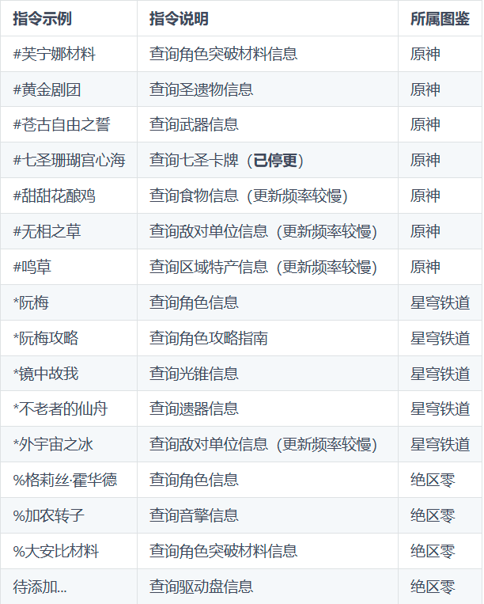

# Atlas
Atlas是一个适用于V3版本及以上Yunzai-Bot的图鉴查询插件，可通过Yunzai-Bot查询游戏图鉴，插件代码严格遵循ES6规范。

## 当前支持图鉴库

【已完成】[`米游社@听语惊花`](https://bbs.mihoyo.com/ys/accountCenter/postList?id=289918413)制作的原神图鉴库：[Genshin-Atlas](https://gitee.com/Nwflower/genshin-atlas)

【已完成】[`米游社@听语惊花`](https://bbs.mihoyo.com/ys/accountCenter/postList?id=289918413)制作的崩坏：星穹铁道图鉴库：[star-rail-atlas](https://gitee.com/Nwflower/star-rail-atlas)

【正在适配】碧蓝航线图鉴库(暂无仓库地址)

## 如何获取
### 1、下载插件本体

使用github获取插件

在Yunzai-Bot根目录下，运行cmd，输入以下指令
```
git clone --depth=1 https://github.com/Nwflower/atlas ./plugins/Atlas/
```

如果运行失败，可以使用gitee镜像源，指令如下
```
git clone --depth=1 https://gitee.com/Nwflower/atlas ./plugins/Atlas/
```

### 2、获取图片资源
安装插件后，发送`#图鉴升级`获取图鉴图片即可正常使用。

如果升级失败了，需要手动拉取。请在Atlas目录下执行以下语句

```
git clone --depth=1 https://gitee.com/Nwflower/genshin-atlas.git ./Genshin-Atlas
```

如果你要获取崩坏：星穹铁道的图鉴，请发送`#崩铁图鉴升级`

代码部分的更新请使用`#图鉴插件升级`来更新本插件。

### 3、图鉴指令
获取图鉴图片后，可以根据相应的指令获取图鉴。




此外，如果对某些物品的名字记忆模糊，可以根据对应索引查询：
1. `#武器索引`口令唤出武器索引，逐级查询想要找的武器
2. `#原魔`口令唤出原魔索引，逐级查询想要找的原魔
3. `#圣遗物`口令唤出圣遗物一级索引，直接查询想要找的圣遗物
4. `七圣召唤`口令唤出七圣召唤卡牌索引，逐级查询想要找的七圣召唤卡牌

### 4、兼容性更改
本插件支持动态优先级。

如要更改插件优先级，请找到文件`Atlas\resource\config.yaml`下的相应属性：
priority为优先级，默认为10
success为匹配指令拦截，默认为TRUE

如果你对上述规则不满意，可以查阅第五点：

### 5、拓展：修改图鉴匹配规则（可以不修改）
如果你对当前图鉴匹配效果不满意，可以修改图鉴匹配规则以让插件更频繁或更少触发

规则文件在`resource/Forlibrary/对应图鉴库名/rule/对应分类名.yaml`里查看，如不存在对应文件夹目录名（例如圣遗物artifact的对应yaml不存在，则以默认config.yaml为准）

规则文件中，`mode`为匹配模式。
以原神图鉴库口令`#雾切之回光`为例：
1. 当模式为不完全匹配（mode:1）时，`#雾切`、`#回光`、`#雾切之回光`均视为该口令，`#雾切之回光是什么武器`不视为该口令。
2. 当模式为完全匹配（mode:2）时，`#雾切之回光是什么武器`、`#神里面板换雾切之回光`均视为该口令，`#回光`、`#雾切之回`不视为该口令。
3. 当模式为等同匹配（mode:0）时，仅`#雾切之回光`视为该口令。

规则文件中，`condition`为正则条件。
仍以图片`雾切之回光.png`为例，想要发送该图片:
1. 当条件为直接匹配（condition:0）时,口令`雾切之回光`才能发送该图片。
2. 当条件为`前缀#`（condition:1）时,口令`#雾切之回光`才能发送该图片，`雾切之回光`不能发送该图片。
3. 当条件为任意关键词（condition:2）时,需要配置关键词列表（pick）。若以默认关键词`图鉴`为例,口令`图鉴雾切之回光`、`雾切之回光图鉴`能发送该图片，`雾切之回光`、`#雾切之回光`不能发送该图片，因为它们不包含关键词。
4. 当条件为1或2（condition:3）时。满足条件1或满足条件2时都能发送该图片。除此之外，`#雾切之回光图鉴`也能发送该图片。但是当你的条件配置为1的时候，或者配置为2的时候（condition=1或2），这种口令不能正常触发。
5. 当条件为1且2（condition:4）时。满足条件1的情况下还要满足条件2时才能发送该图片。如`#雾切之回光图鉴`、`#图鉴雾切之回光`才能发送该图片，只满足一个不能正常触发。

规则文件中，`pick`为关键词列表
1. 关键词列表只在（condition>=2）的时候才会生效。当没有配置关键词列表，则默认为“图鉴”。
2. 以七圣召唤的规则（card.yaml）为例，pick中含有两词，分别为`七圣`和`牌`，又因为condition==2，所以如果要发送图片`凯瑟琳.png`，你必须使用口令`七圣凯瑟琳`、`凯瑟琳牌`才能发送该图片。
3. 第2点中，口令`#七圣凯瑟琳`、`#凯瑟琳牌`均不能发送该图片。
4. 最终口令只与去掉关键词和前缀#的实际词语有关，而与关键词的位置、个数、种类无关。比如第2点中，口令`凯七圣瑟琳`、`七圣凯瑟琳七圣牌`均能发送该图片。

**特殊情况说明**

1. 你可能会发现，即使你的规则为等同匹配，`#雾切`也能够触发图片`雾切之回光`，这是因为在别名文件`resource/Forlibrary/对应图鉴库名/othername/对应文件夹目录名.yaml`中，雾切之回光的别名含有雾切。所以，`#雾切`正确匹配的是`雾切`，`雾切`相当于发送`雾切之回光`的图片。故而，完全匹配模式中，口令`#雾切之回`也能触发别名`雾切`，从而发送`雾切之回光`的图片
2. `前缀#`只在（condition=1、3或4）的时候才会生效，否则将视为你文件名的一部分。

### 6、原神功能：原魔属性计算使用说明

在图鉴3.4或者更晚的版本中，加入了功能【原魔属性计算】可以快速查询某原魔的生命值或者攻击力。

格式形如`#90级恒常机关阵列生命值`、`#12-3魔偶剑鬼攻击力`、`#4人无相之水生命值`等等。

## 如何更新

| 更新要求                     | 更新插件对应口令     | 更新原神拓展包口令 | 更新崩铁拓展包口令   |
| ---------------------------- | -------------------- | ------------------ | -------------------- |
| 更新，但是保留本地更改       | 图鉴插件升级         | 图鉴升级           | 崩铁图鉴升级         |
| 更新且忽略暂存区修改         | 图鉴插件强制升级     | 图鉴强制升级       | 崩铁图鉴强制升级     |
| 回退版本后再更新             | 图鉴插件强行升级     | 图鉴强行升级       | 崩铁图鉴强行升级     |
| 放弃所有和远端仓库不同的文件 | 图鉴插件强行强制升级 | 图鉴强行强制升级   | 崩铁图鉴强行强制升级 |

## 致谢

| ProjectName | Contribution |
|---------|-----:|
| [Csxylic](https://www.miyoushe.com/ys/accountCenter/postList?id=258229537) | 提供原魔数据、原魔属性 |
| [xiaoyao-cvs-plugin](https://gitee.com/Ctrlcvs/xiaoyao-cvs-plugin) | 参考武器、圣遗物别名 |
| [Yunzai-Bot小飞插件](https://gitee.com/xfdown/xiaofei-plugin) | 参考消息发送风控处理代码 |

## 反馈

如果你需要提出issue或者PR，请前往github的相关页面。

[提出issue](https://github.com/Nwflower/Atlas/issues)

[发起PR](https://github.com/Nwflower/Atlas/pulls)

当然，你也可以使用QQ群组功能反馈。**点击加入[Atlas交流群](https://qm.qq.com/cgi-bin/qm/qr?k=XOTZhBWpv68F1sfsMIzKJpg28NBPKJgg&jump_from=webapi&authKey=/XagQoLiUhOi+t67MCkWOSRLlXe+ywVmrkCHdoD3CjwqNzAUYspTrqYklkwb3W0R)**。

## 其他

最后给个star或者[爱发电](https://afdian.net/a/Nwflower)，你的支持不会获得额外内容，但会提高本项目的更新积极性

严禁用于任何商业用途和非法行为
